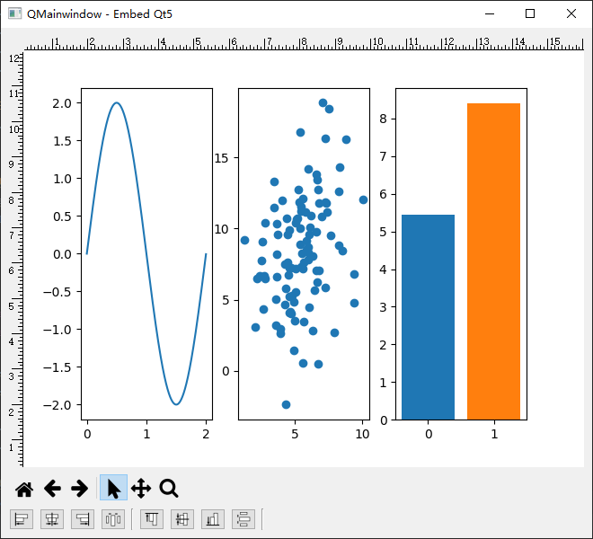

.. -*- mode: rst -*-

Pylustrator-embedqt5
===============================

Embedded in Pyqt5 as a Qwidget, based on pylustrator 0.9.4  `pylustrator0.9.4 <https://github.com/rgerum/pylustrator/tree/v0.9.4>`_

Visualisations of data are at the core of every publication of scientific research results. They have to be as clear as
possible to facilitate the communication of research. As data can have different formats and shapes, the visualisations
often have to be adapted to reflect the data as well as possible. We developed Pylustrator, an interface to directly
edit python generated matplotlib graphs to finalize them for publication. Therefore, subplots can be resized and dragged
around by the mouse, text and annotations can be added. The changes can be saved to the initial plot file as python code.

Keywords: python, matplotlib, draggable subplots, texts, annotations, code generation

Please refer to our `Documentation <https://pylustrator.readthedocs.io>`_ for more information and instructions on installing it.

python:

    python==3.8.19
    

requires:

    - natsort
    - matplotlib==3.7.5
    - qtpy
    - qtawesome

    